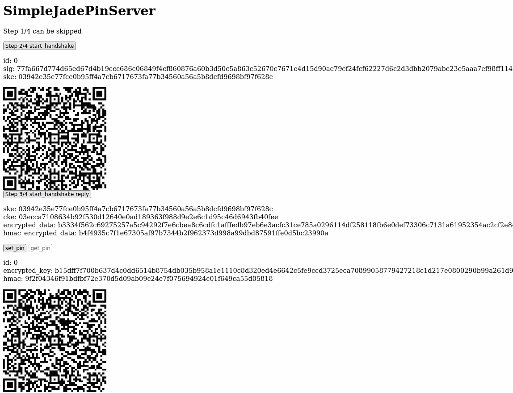

SimpleJadePinServer
===================

A simple reimplementation of the [blind_pin_server](https://github.com/Blockstream/blind_pin_server) for the Blockstream Jade hardware wallet along with a very simple web interface.

Running SimpleJadePinServer
---------------------------

### Prerequisites

```console
apt update
apt install python3 python3-pip python3-venv
python3 -m venv venv
source venv/bin/activate
pip install wallycore
```

### Get an SSL/TLS certificate

Or generate a self signed certificate

```console
openssl req -new -x509 -keyout server.pem -out server.pem -days 3650 -nodes
```

### Start SimpleJadePinServer.py

```console
python3 SimpleJadePinServer.py
```

The web interface will be available at https://127.0.0.1:4443



Pointing the Jade to the pin server
-----------------------------------

A private.key and a public.key file will be generated in the working directory. The public.key will then have to be used when pointing the Jade to the pin server.

```console
git clone https://github.com/Blockstream/Jade
cd Jade
python3 set_jade_pinserver.py --serialport <ENTERJADESERIALPORT> --set-pubkey path/to/SimpleJadePinServer/public.key --set-url http://127.0.0.1:8086
```

It really does not matter where the URL is pointed to since the SimpleJadePinServer does not use the BCUR QR code from step 1/4. The only important parameter here is the public key of the pin server.
