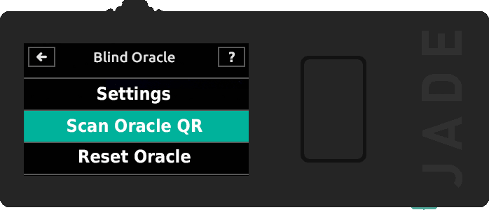

SimpleJadePinServer
===================

A simple reimplementation of the [blind_pin_server](https://github.com/Blockstream/blind_pin_server) for the Blockstream Jade hardware wallet, along with a very basic web interface.

Running SimpleJadePinServer
---------------------------

### Prerequisites

```console
apt update
apt install python3 python3-pip python3-venv
python3 -m venv venv
source venv/bin/activate
pip install wallycore
```

### Get an SSL/TLS certificate

Or generate a self signed certificate

```console
mkdir key_data
cd key_data
openssl req -new -x509 -keyout server.pem -out server.pem -days 3650 -nodes
cd ..
```

### Start SimpleJadePinServer.py

```console
python3 SimpleJadePinServer.py
```

On first run, a static server key pair (`private.key` and `public.key`) will be generated in the `key_data/server_keys` directory.

The web interface will be available at https://127.0.0.1:4443


Pointing the Jade to the pin server
-----------------------------------

To point the Jade to the pin server, click the "Oracle QR code" link or navigate to https://127.0.0.1:4443/oracle_qr.html


Click the "Generate QR code" button.

Power on the Jade and access the boot menu by clicking (not holding) the select button once while the logo appears.
- Note: Jade will need to be uninitialized in order to set a new blind oracle. If your Jade is already set up, you will need to perform a factory reset and **restore using your recovery phrase as your wallet will be deleted. Your funds will be lost if you do not have the correct backup materials.**
  - Source: https://help.blockstream.com/hc/en-us/articles/12800132096793-Set-up-a-personal-blind-oracle


Select "Blind Oracle" and then "Scan Oracle QR".



Scan the the generated QR code and then confirm the details on screen.


Note that it really does not matter where the URL is pointed to since the `SimpleJadePinServer` does not use the BCUR QR code from step 1/4. The only important parameter here is the public key of the pin server.

<details>
<summary>Alternative setup via USB</summary>

An alternate way of pointing the Jade to a custom pin server is via a USB connection to a computer using the `set_jade_pinserver.py` script in the Jade repository.

```console
git clone https://github.com/Blockstream/Jade
cd Jade
python3 set_jade_pinserver.py --serialport <ENTERJADESERIALPORT> --set-pubkey path/to/SimpleJadePinServer/public.key --set-url http://127.0.0.1:8086
```
</details>

The Jade is now configured with the static server public key of the `SimpleJadePinServer`.

Using SimpleJadePinServer
-------------------------

Once the Jade is configured to work with `SimpleJadePinServer`, initialize the wallet. When asked to select a connection, choose QR.

1. After providing a six digit pin, the Jade will display Step 1/4 with a series of BC-UR QR codes. This step can be skipped.

2. The Jade will then display Step 2/4 and ask you to scan a BC-UR QR code. Make sure that `SimpleJadePinServer` is running and navigate to https://127.0.0.1:4443 in your web browser. Click the button labelled "Step 2/4 start_handshake". This will show a series of BC-UR QR codes you can scan with your Jade.


3. Once scanning is complete, the Jade will proceed to Step 3/4 and show a series of BC-UR QR codes on its screen. Click "Step 3/4 start_handshake reply" in the web interface. This will use the computer's camera to scan the QR codes displayed on the Jade.


Once it is done scanning, the camera interface will automatically disappear.

4. Continue to Step 4/4 on the Jade and click "set_pin" in the web interface. This will show another series of BC-UR QR codes which can be scanned by the Jade.


Once that is scanned, you are done and the wallet is ready to be used.

### Unlocking the wallet

If you want to unlock the wallet at some later point, select "QR Mode" -> "QR PIN Unlock" on the Jade. Enter your PIN and perform the same steps as described before. The only difference being at step 4/4 where you will have to click "get_pin" instead of "set_pin" in the web interface.
