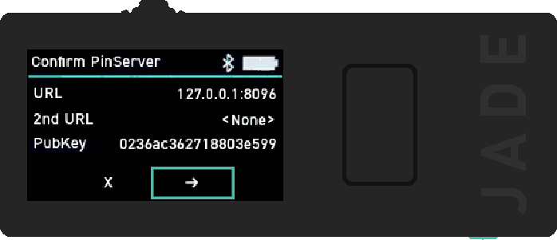

SimpleJadePinServer
===================

A simple reimplementation of the [blind_pin_server](https://github.com/Blockstream/blind_pin_server) for the Blockstream Jade hardware wallet, along with a very basic web interface.

Note: The newest version of `SimpleJadePinServer` requires Jade firmware that includes support for the shorter two-step blind oracle protocol, which was first implemented in version 1.0.28. If you need to use the old four-step protocol, you can revert to [v1](https://github.com/Filiprogrammer/SimpleJadePinServer/tree/v1).

Running SimpleJadePinServer
---------------------------

### Prerequisites

```console
apt update
apt install python3 python3-pip python3-venv
python3 -m venv venv
source venv/bin/activate
pip install wallycore
```

### Optional: Get an SSL/TLS certificate

To use the web interface from a non-localhost connection, an SSL/TLS certificate is needed. This is because modern web browsers require secure context (HTTPS or localhost) for the web interface to access the webcam, which is needed to scan the QR codes of the Jade.

#### Example: Generate a self signed certificate

```console
mkdir key_data
cd key_data
openssl req -new -x509 -keyout server.pem -out server.pem -days 3650 -nodes
cd ..
```

This will create a certificate (`server.pem`) in the `key_data` directory.

#### Alternative: Use a Reverse Proxy

Alternatively a reverse proxy (such as Caddy or NGINX) can be used to serve the web interface over HTTPS.

### Start SimpleJadePinServer.py

```console
python3 SimpleJadePinServer.py
```

On first run, a static server key pair (`private.key` and `public.key`) will be generated in the `key_data/server_keys` directory.

The web interface will be available at https://127.0.0.1:4443

To disable TLS use the `--no-tls` option

```console
python3 SimpleJadePinServer.py --no-tls
```

The web interface will be available at http://127.0.0.1:4443


Running SimpleJadePinServer with Docker Compose
-----------------------------------------------

Instead of manually installing the dependencies, SimpleJadePinServer can be launched in a Docker container using the provided `docker-compose.yml` file:

```console
docker compose up
```

The web interface will be available at http://127.0.0.1:18080

Note that docker compose will start the server without TLS - use a reverse proxy like Caddy or NGINX if you need to serve from a non-localhost address.

Pointing the Jade to the pin server
-----------------------------------

To point the Jade to the pin server, click the "Oracle QR code" link or navigate to https://127.0.0.1:4443/oracle_qr.html


Click the "Generate QR code" button.

Power on the Jade and access the boot menu by clicking (not holding) the select button once while the logo appears.
- Note: Jade will need to be uninitialized in order to set a new blind oracle. If your Jade is already set up, you will need to perform a factory reset and **restore using your recovery phrase as your wallet will be deleted. Your funds will be lost if you do not have the correct backup materials.**
  - Source: https://help.blockstream.com/hc/en-us/articles/12800132096793-Set-up-a-personal-blind-oracle


Select "Blind Oracle" and then "Scan Oracle QR".


Scan the the generated QR code and then confirm the details on screen.



Note that if the Jade is only ever meant to be used in QR mode, it does not matter where the URL is pointed to, making the public key of the pin server the only important parameter.

<details>
<summary>Alternative setup via USB</summary>

An alternate way of pointing the Jade to a custom pin server is via a USB connection to a computer using the `set_jade_pinserver.py` script in the Jade repository.

```console
git clone https://github.com/Blockstream/Jade
cd Jade
python3 set_jade_pinserver.py --serialport <ENTERJADESERIALPORT> --set-pubkey path/to/SimpleJadePinServer/public.key --set-url http://127.0.0.1:8086
```
</details>

The Jade is now configured with the static server public key of the `SimpleJadePinServer`.

Using SimpleJadePinServer in QR mode
------------------------------------

Once the Jade is configured to work with `SimpleJadePinServer`, initialize the wallet. When asked to select a connection, choose QR.

### Step 1/2

After providing a six digit pin, the Jade will display Step 1/2 with a series of BC-UR QR codes. Click "Step 1/2 pin request - Jade &rarr; pin server" in the web interface. This will use the computer's camera to scan the QR codes displayed on the Jade.


Once it is done scanning, the camera interface will automatically disappear.

### Step 2/2

Next click the button labelled "Step 2/2 pin reply - pin server &rarr; Jade". This will show a series of BC-UR QR codes.


On the Jade continue to Step 2/2 and scan the BC-UR QR codes.


Once scanning is complete, you are done and the wallet is ready to be used.

### Unlocking the wallet

If you want to unlock the wallet at some later point, select "QR Mode" -> "QR PIN Unlock" on the Jade. Enter your PIN and perform the same steps as described before.

Using SimpleJadePinServer in USB or BLE mode
--------------------------------------------

Once the Jade has its blind oracle configured to point to `SimpleJadePinServer`, simply use the Jade with Blockstream Green as normal. Blockstream Green might complain the first time, that a non-default blind oracle is being used.


This can be dismissed by first clicking on "Advanced", then enabling "Don't ask me again for this oracle" and finally clicking on "Allow Non-Default Connection".


